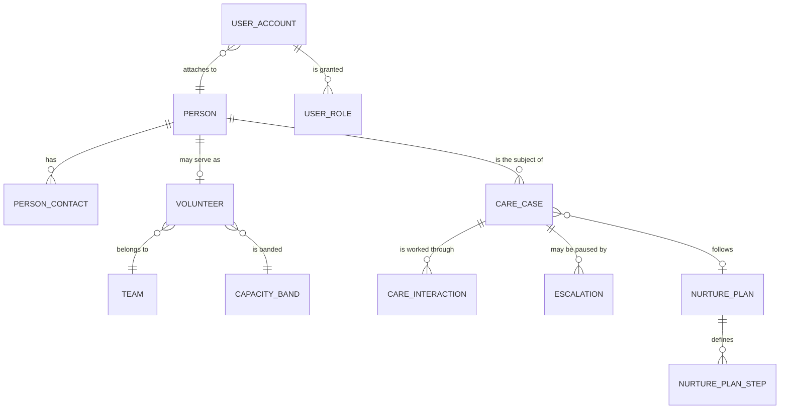
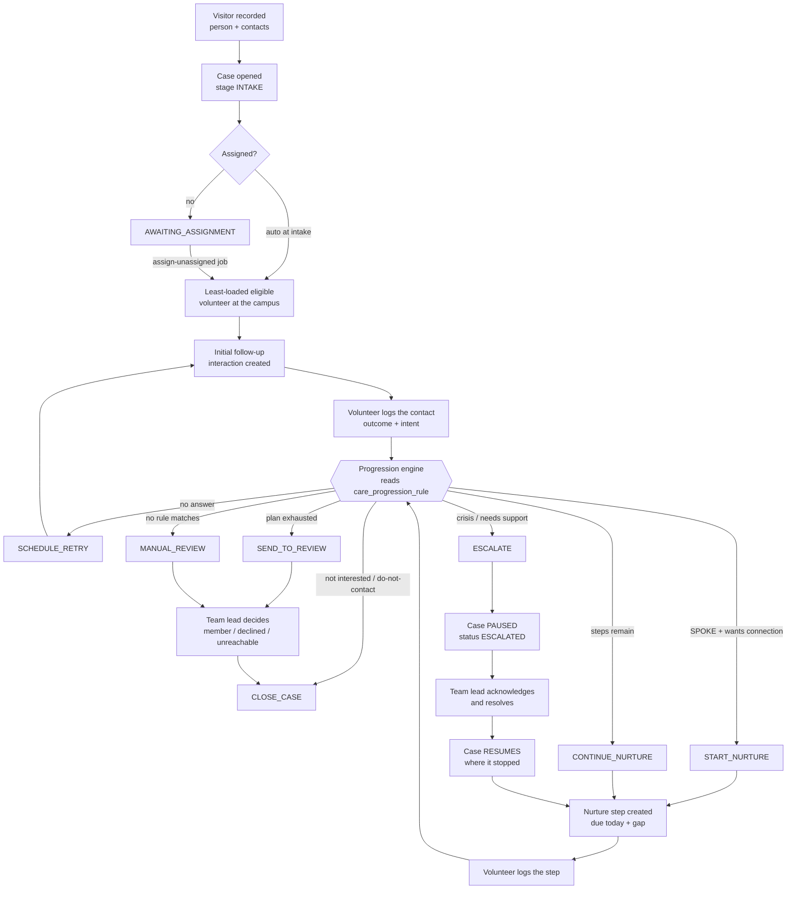
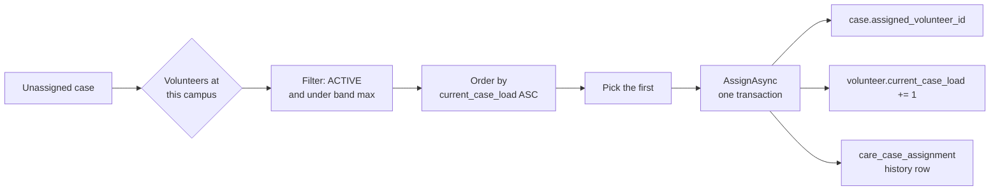
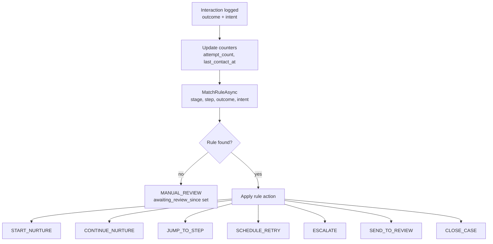
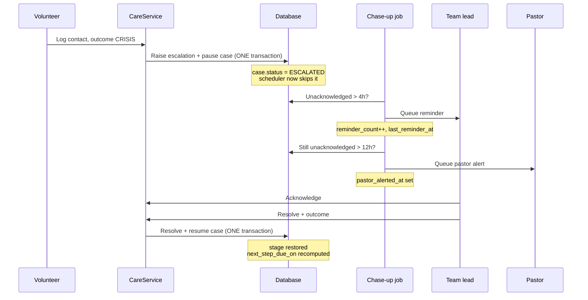
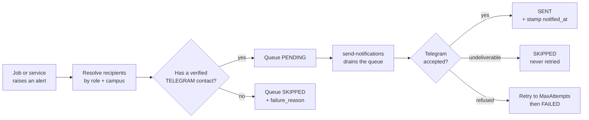
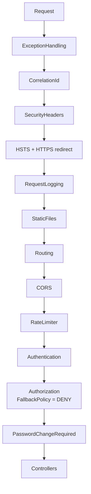

# RM_CMS — System Workflow

How the system actually works, as of **2026-08-15**. Companion: [TESTING.md](../testing/TESTING.md).

> **Since this was written (as of 2026-09-07):** the architecture, schema and security
> model below are unchanged and still accurate. §12 "Current state" is not — the Pastor
> dashboard has since been built and verified (`Modules/Dashboards`'s `IPastorDashboardService`,
> `GET /api/dashboards/pastor`), and the entire legacy pre-rewrite layer this doc calls
> "4 superseded legacy slices deleted" / "5 more unreachable" has now been deleted in
> full — `Controllers/`, `BLL/`, `DAL/`, `Data/DTO/`, `Data/Models/` no longer exist,
> everything runs through `Modules/*`. See [`docs/testing/manual/04-team-lead-dashboard.md`](../testing/manual/04-team-lead-dashboard.md)
> and this repo's git log for what's landed since.

---

## 1. What the system is for

Someone new visits the church. RM_CMS makes sure a real person follows up with them, that
the follow-up keeps going for weeks rather than fizzling out, and that if the visitor
discloses a crisis it reaches a team lead — and a pastor if nobody responds.

The whole design turns on one thing: **a person must not fall through the gap.** Most of
the mechanics below exist because some specific way of falling through the gap was
observed in the MVP.

---

## 2. Core model



Four ideas do most of the work:

| Concept | Meaning |
|---|---|
| **`person`** | The single canonical human record. A visitor, a volunteer and a user account are all *the same person* — the MVP duplicated names and phone numbers five ways |
| **`care_case`** | One unit of engagement: this person, this journey, right now. Exactly one open case per person |
| **`care_interaction`** | One planned or completed contact — an initial follow-up attempt or a nurture step |
| **`escalation`** | A concern that outranks the routine journey. **It pauses the case** |

### Three kinds of identity

Every table carries all three, and they are **not** interchangeable:

| Column | Purpose | Rule |
|---|---|---|
| `id` BIGINT | Internal key, all joins and FKs | **Never** appears in a URL, payload or log |
| `public_id` CHAR(26) ULID | What the API exposes | Sortable by creation time; not enumerable |
| `reference_code` VARCHAR(20) | What staff say aloud ("V001") | `UNIQUE` but **never** joined on |

Sequential ids in URLs let any authenticated caller walk the whole dataset — that was a
live hole in the MVP, and ULIDs close it at the identifier level rather than by a check.

---

## 3. The journey end to end



### Stages and statuses

`care_case` carries both, and they answer different questions.

| `stage` — *where in the journey* | `status` — *what is happening now* |
|---|---|
| `INTAKE` | `OPEN` |
| `INITIAL_FOLLOW_UP` | `AWAITING_ASSIGNMENT` |
| `NURTURE` | `IN_PROGRESS` |
| `REVIEW` | `ESCALATED` ← paused |
| `CLOSED` | `ON_HOLD`, `CLOSED` |

Both are `CHECK`-constrained vocabularies rather than admin-editable lookups, deliberately:
code branches on them, so if an administrator renamed `OPEN` every `if (status == "OPEN")`
would silently stop matching.

---

## 4. Assignment and capacity



Bands come from `capacity_band`: `LIMITED` 1–2, `BALANCED` 2–3, `CONSISTENT` 4–6 per week.

**The counter is authoritative.** `volunteer.current_case_load` is *maintained*, updated in
the same transaction as the row that causes the change — never recomputed on read. The MVP
kept the same figure in a counter *and* derived it live from another table, and the two
drifted. A nightly reconciliation should **assert** counter == derived and report drift
rather than silently correcting it.

The same shortlist backs both the batch job and `GET /api/volunteers/eligible`, so a team
lead assigning by hand sees exactly what the scheduler would have picked.

---

## 5. The progression engine — decisions are data

This is the single most important design decision in the system.

**Before (MVP):** a hard-coded C# `switch` over lower-cased strings — `"needs follow-up"`
*and* `"needs followup"` — so a wording change in the UI produced *"Unknown response type"*
at runtime, and changing the workflow meant a deployment.

**Now:** a row in `care_progression_rule`, matched on `(stage, step_number, outcome, intent)`.



Rules are evaluated **priority-first**: the lowest priority number that matches wins, with
specificity only as a tie-break. Ranking by specificity instead let a narrow rule like
`(NURTURE, SPOKE, any)` outrank `(any, any, NOT_INTERESTED)` — so someone who said "not
interested" mid-sequence kept getting calls.

**Anything unmatched falls through to `MANUAL_REVIEW`**, never a guess. An unforeseen
combination reaches a human instead of quietly doing the wrong thing.

Behaviour also lives in the lookup, not the code: `care_outcome` carries
`opens_escalation`, `starts_nurture`, `schedules_retry`, `closes_case` and a default tier.

**Separation of duties:** the engine decides and mutates the case *in memory only*. Creating
the next interaction row and raising escalations belongs to the service, which owns those
transactions.

### Do-not-contact follows the person

When a logged intent is flagged `implies_do_not_contact`, the block is written to
**`person.do_not_contact`**, not the case. It therefore survives the case closing and
applies again if that person is recorded as a new visitor months later.

---

## 6. Nurture

A `nurture_plan` defines the sequence; `nurture_plan_step` defines each step's method and
gap. Steps are created **one at a time**, not pre-built — the case records where it is:

| Field | Meaning |
|---|---|
| `nurture_plan_id` | Which plan |
| `current_step_number` | How many steps are **completed** |
| `next_step_due_on` | When the next becomes due — what the scheduler picks up on |

So the step to create next is always `current_step_number + 1`.

Who runs it depends on the plan's `assignment_mode`:

| Mode | Behaviour |
|---|---|
| `SAME_VOLUNTEER` | Always whoever holds the case |
| `SAME_IF_AVAILABLE` | Keep them if active and under capacity, else reassign |
| `LEAST_LOADED` | Always re-pick |

When the plan is exhausted the case goes to `REVIEW` — the system does **not** close a case
on its own authority. A team lead makes the member/declined/unreachable call.

---

## 7. Escalation — pause and resume

The mechanic that makes crisis handling safe.



Both halves are single transactions on purpose. A half-applied escalation would either
stall a case forever or let contact continue on an unresolved safeguarding concern.

| Tier | Meaning |
|---|---|
| `STANDARD` | Routine concern |
| `URGENT` | Needs attention today |
| `EMERGENCY` | Skips the pastor-alert wait entirely |

`ck_escalation_resolved` enforces at the database level that a resolved escalation records
**when** and **how** — regardless of which code path writes the row.

Resolution **resumes** the sequence where it stopped; it does not restart it. Re-contacting
someone from step 1 immediately after a crisis would be its own harm.

---

## 8. Scheduled jobs

There is **no in-process scheduler**. An external cron calls the endpoints. That keeps jobs
runnable on demand — a team lead reporting "nobody was told about my escalation" can have
the sweep run and inspected immediately — and means a second instance does not silently
double every job.

| Job | Route | What it drains |
|---|---|---|
| Assignment | `POST /api/jobs/assign-unassigned` | Cases with no volunteer |
| Nurture | `POST /api/jobs/advance-nurture` | Cases whose next step has fallen due |
| Overdue | `POST /api/jobs/mark-overdue` | Pending contacts past their date + grace |
| Chase-up | `POST /api/jobs/chase-escalations` | Escalations nobody acknowledged |

Shared shape: take a **bounded batch**, process each item independently, count what worked,
record the run in `job_run`. One bad row never abandons the queue. Every job is **idempotent**
— its query only returns rows that still need the work.

`run-all` runs them in dependency order: assign first so a new case can get its first
contact, nurture next, overdue after that so a just-created step is not swept, chase-ups
last because the earlier jobs can raise new escalations.

Two behaviours worth stating explicitly:

- **A chase-up that reaches nobody is a `FAILED` job, not a success.** Silence is the bug
  this job exists to prevent, so it cannot report success while telling no one.
- **Marking a contact missed does not advance the case.** The engine reasons from a
  *completed* interaction with an outcome; a miss has none. What repeated misses should mean
  belongs in `care_progression_rule`, not hard-coded in a job.

Thresholds are configuration, not code — `app_setting`: `escalation.ack_target_hours` (4),
`escalation.reminder_every_hours` (4), `escalation.pastor_alert_hours` (12),
`nurture.lookahead_days` (1), `assignment.max_retry_attempts` (3).

---

## 9. Notifications



The queue records that an alert is **owed** and to whom. It deliberately never talks to
Telegram, so a channel outage cannot roll back the domain transaction that raised the alert.
The `send-notifications` job drains it on a separate sweep, where a Telegram failure costs
a retry rather than the escalation itself.

The queue stores the **chat id** (`person_contact.normalized_value`), not the displayed
`@username` — the Bot API can only send to the former. A contact that is unverified or
opted out resolves as unreachable, so somebody who disconnected is recorded `SKIPPED`
rather than queued for a send that could never land.

**Message bodies are never stored.** Alerts quote pastoral detail and names; only the
outcome is retained.

An unreachable recipient is recorded rather than dropped — "the team lead has no Telegram
contact" is the actual reason nobody responded, and it needs to be visible somewhere other
than a log line.

**The message body is composed at send time**, from the entity as it stands then — not as
it stood when the alert was queued. For a chase-up that is the behaviour you want: an
escalation acknowledged in the meantime is dropped rather than nagged about, because
alerts about already-handled work are how people learn to ignore alerts.

> **Sent, skipped and failed mean different things.** `SKIPPED` is undeliverable by nature
> (no chat id, entity gone, alert moot) and is never retried, because retrying cannot
> change it. `FAILED` was attempted and refused, and is retried to `MaxAttempts` first.
> When the bot is simply not configured the queue is left **untouched** — burning the
> attempt budget on a misconfiguration would leave the backlog dead rather than
> deliverable once somebody supplied the token.

---

## 10. Security model



Order is deliberate: exception handling wraps everything so nothing escapes as a stack
trace; the correlation id is assigned before anything logs; CORS precedes auth so preflight
needs no token; rate limiting precedes auth so unauthenticated floods are cheap to reject.

**Tokens.** A 15-minute access token held in memory only, plus a refresh token in an
HttpOnly / Secure / SameSite=Strict cookie. Refresh **rotates**; replaying a used token
revokes the entire family. Account state is re-checked on every request, so logout,
password change, role change and disable take effect immediately rather than whenever the
access token happens to expire.

**Default deny.** `FallbackPolicy = RequireAuthenticatedUser()`. A controller that forgets
`[Authorize]` is still protected. This closes the "unintentionally public" class of bug
permanently rather than one controller at a time — **do not remove it.**

**Two layers of authorization:**

| Layer | Where | Enforces |
|---|---|---|
| Role policies | `[Authorize(Policy = ...)]` on the action | Can this *kind* of user do this at all |
| Campus scoping | `ICurrentIdentity.CanAccessCampus()` inside the service | Can this user touch *this record* |

Scoping lives in the service, not just the controller, so it holds however the endpoint is
reached. `campus_id` is denormalised onto `volunteer`, `care_case`, `escalation` and
`event_series` so a scoped query never needs a join to enforce access.

> **Known boundary:** campus is enforced; per-volunteer ownership is checked only when
> logging an interaction. Two volunteers at the same campus can otherwise see each other's
> cases. That is the documented design — confirm it matches your safeguarding policy.

Secrets (`Jwt__SigningKey`, `Auth__ServiceApiKey`, connection string, bot token) come from
environment variables. The app **refuses to boot** on a weak or missing signing key. Third-party
secrets must never go in `app_setting` — the MVP kept the live bot token there in plaintext,
reachable through a generic settings API.

---

## 11. Where the invariants live

The deciding rule: put it in the database when it must hold **regardless of which code path
writes the row**. Business rules needing context stay in the service.

**In the database:**
- A closed case has `closed_at` and `close_reason`
- A completed interaction has `occurred_at` and an outcome
- A resolved escalation has `resolved_at` and an outcome
- A confidential note names the role that may read it
- A refresh token cannot expire before it was issued

**In the service (they need data the row does not have):**
- A volunteer's case load must not exceed their band's max
- A crisis case needs a crisis-trained volunteer with a current background check
- Exactly one `care_outcome` behaviour flag should normally be set

**Concurrency.** Rows two people can edit at once carry `row_version`. Updates guard on it:

```sql
UPDATE care_case SET status = @Status, row_version = row_version + 1
 WHERE id = @Id AND row_version = @RowVersion;
```

**Zero affected rows means a conflict, not a no-op.** Re-read and retry, or surface it —
never treat it as success.

---

## 12. Current state

| Built | Not built |
|---|---|
| Identity — auth, accounts, roles | Pastor dashboard |
| People — records, contacts, DNC, lifecycle | Admin settings API |
| Volunteers — capacity, teams, safeguarding | Volunteer surveys |
| Care — cases, contacts, escalations, progression | 16 of 17 frontend pages |
| *(4 superseded legacy slices deleted 2026-08-22)* | *(5 more are unreachable — next pass)* |
| Jobs — five sweeps + audit ledger | Automated tests, MVP data migration |
| Notifications — queue **and Telegram sender** | Live-bot delivery (verified against a stub only) |
| Dashboards — team lead landing page (existing UI) | Volunteer surveys, Team Huddle |
| Check-ins — the team lead's pastoral duty | Pastor dashboard |

The application does not yet run end-to-end for an ordinary user: the API works, but almost
nothing calls it. See `Migration Status` in the knowledge base for the ordered backlog.
